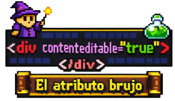

<p align="center">
  
</p>

### Introducción: 
No hace mucho tuve la suerte de hacer un trabajo, una modificación a una web  
interactiva para una comunidad fandom, y buscando recursos terminé encontrando  
entre mis cosas un trabajo modular extenso, de unos diez años (tal vez más), con  
muchos elementos que tomé prestado. Fue ahí, leyendo, que di nuevamente con este  
_atributo brujo_ que me sirivió nuevamente en el presente y que de paso se me  
ocurrió rendirle un poco de homenaje:  
  


`Viajamos a los años 1999/2000 cuando internet explorer introdujo el atributo  
que había llegado para convertirse en un "editor" dentro de la pagina, algo  
adelantado para sus tiempos, pero fue así que con el tiempo otros navegadores 
decidieron incluirlo. Su uso se extendió a muchos niveles, sistemas de chats, juegos interactivos, editores de texto online, exprimentación creativa, educación en general, etc.
Lo interesante es que los navegadores al incluir la lógica "de fábrica" el atributo no necesita de JavaScript para poder escribir, manejar el cursor,  
seleccionar, borrar, pegar; interpretar eventos y un largo etc. (sin pogramar casi nada)
`  

#### Realicé una githubpage para ilustrar algunos pocos (pero divertidos) ejemplos:   

 <a href="https://agustincmp.github.io/el-atributo-brujo/" title="THERE">🔗​</a>  

 #

### Profundizando...

> Sí, su uso junto a **JS** permite desplegar una variedad enorme  
  de artilugios, pero en principio lo veremos con apenas poco JS  

 _Mientras **C**ontent **E**ditable esta en el html podemos realizar unos cammbios básicos desde Css:  
usando el selector y la pseudoclase (como se observa abajo en el ejemplo)  
logramos quitar el borde de selección impuesto por los navegadores._ ⬇️​  
```css
[contenteditable="true"]:focus {
  outline: none;
}   
```  
📑​ Algunos navegadores pueden comportarse raro al remover el _outline_ y no es  
mala idea agregar debajo un _box-shadow_ (quedando la indicación visual)

#

_Agregando una clase para crear un placeholder:_
```html
<div class="editable" contenteditable="true"></div>
```  
_Aquí el css_  
```css
.editable:empty::before {
    content: "Escribí";
    color: #fff;
}
```
#

_Aquí abajo un ejemplo de **CE**+JS inline (muy poquito):_  
```html
<div id="edit" contenteditable="true" onclick="this.innerText=''">
  ```  
📑 ​Vemos como sumando el atributo **onclick** y agregando al lado poquísimo JS  
la acción sobre el elemento permite abrir una nueva interacción dinámica.


`A medida que uno agrega mas atributos al ya existente CE, las interacciones y apertura de elementos varios se hace visible y demuestra lo entretenido de la experiencia para quien se piense cualquier idea.`  

#
Un atributo que esta bueno incluir si se piensa abrir la edición, es  
el **spellcheck=""** Este atributo no es otra cosa más que un  
corrector de texto, pero que también genera dinámica:
```html
<div contenteditable="true" spellcheck="true"></div>
```

_El uso de **CE** como ya conté antes, no solamente esta limitado para el texto,  
es un elemento de caos, que siempre es ideal controlar. Eso esta determinado  
por el tamaño del trabajo/proyecto que se haga, y su control es mediante JS.  
(+info al explorar console en ghpage). Dicho lo anterior, sí, su punto fuerte  
esta en las posibilidades pensándolo como un multi-editor de texto:_    

El ejemplo mas vistoso y con funciones de todo tipo, es **Medium**, que gran parte de su idea  
radica en **CE**; por supuesto, esta conformada por un diseño complejo, donde  
para controlar el CE se usan APIs que logran hacer muchas tareas que por ejemplo  
antes lo hacia el ya poco usado método:
```JavaScript
document.execCommand("")
```  
_ese pequeño bloque manipulaba lo que se podía hacer con **CE**:  
Un ejemplo simple:_  
```javascript
document.execCommand("bold");
```


📑 ​La mayoria de editores del estilo de Medium, usan CE, pero es solo una fracción  
de lo que se usa para el desarrollo, estamos hablando de sitios mega robustos  
y con estructuras complejas. 
Aquí abajo un ejemplo de como usamos JS para convertir a nuestro pagina web en un  
"minibloc de notas" donde podemos justamente, guardar lo que escribimos: 

Primero asignamos un ID:
```HTML
<div id="edit"...
```  
Luego aplicamos JS (muy poco):  
```JavaScript
const el = document.getElementById("edit");

el.innerHTML = localStorage.getItem("miTexto") || "Escribe aquí";

el.addEventListener("input", () => {

    localStorage.setItem("miTexto", el.innerHTML);
});
```  
Ahi ya tenemos algo que nos permite escribir y luego guardar automáticamente.  

_Si queremos evitar que se inserten otros elementos HTML o algún  
formato raro, podemos utilizar "solo texto plano":_  
```html
<div contenteditable="plaintext-only"></div>
```
#

> La realidad es que una vez que el **contenteditable** esta activado  
> la cantidad de cosas que se pueden hacer en paralelo con JS, escribiendo  
> scripts de mas funciones, de mayor estructura, es casi infinito.  

Realmente pareciera que **CE** es algo simple, pequeño, pero asi como uno  
resalta lo poderoso que lo vuelve **JS**, también es justo repetir, por vez no sé  
cuánta, todo lo que por si solo permite...  
Quizás parezca algo normal para expertos en frontend, pero permitir que una imagen tipo presentacion  
se vuelva editable, y con ello se incluya el uso de CSS, es algo sensacional.  
Ni hablar de los saltos de línea automáticos, ni de cuando al estar activado  
el navegador nos permite pegar casi cualquier elemento, y todas las funciones  
propias de une editor a gran escala; y auque algunos navegadores limiten sus  
capacidades, también se puede usar atajos (shortcuts), tener múltiples zonas de edición  
crear falsos placeholders, crear limites de caracteres; e incontables combinaciones...  

---

> _La cantidad de veces que habrán nombrado a este atributo durante los años
> y ni hablar del sinfín de ejemplos y tantísimo más, seguramente es incalculable.
> Pero hoy, así como hace muchos años me ayudó, y hoy lo volvió hacer, me pareció
> una buena idea dedicarle un repositorio (que probablemete existan varios)_ 


